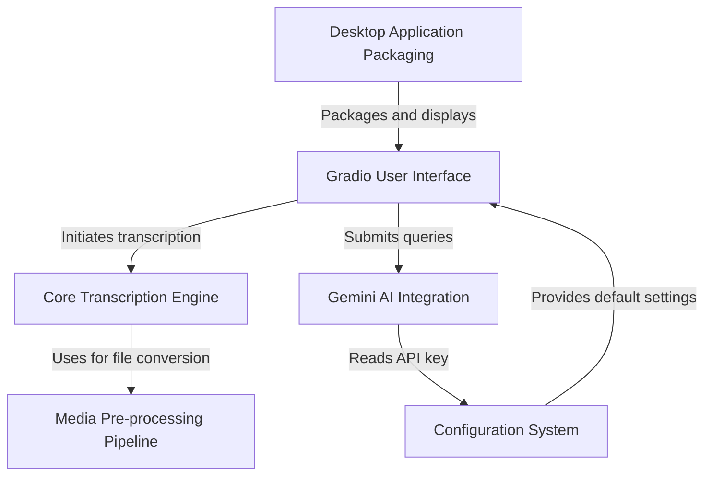

# 🎙️ Whisper Audio/Video Transcription App


## 📝 Description
This project is a transcription app built using the [Faster Whisper model](https://github.com/SYSTRAN/faster-whisper), which transcribes audio and video files into text. It is powered by Gradio for a user-friendly web interface and supports audio or video file uploads for transcription.

## ✨ Features
- 🎧 Transcribe both audio and video files (e.g., MP3, MP4, AVI, etc.)
- ⚖️ Supports multiple model sizes for performance vs. accuracy balance
- 🚀 GPU support for faster transcription using CUDA
- 🎥 Extracts audio from video files automatically
- 🔍 High-precision transcription with options for beam search and other configurations
- 🖥️ Simple UI built with Gradio for easy access and use
- ⬇️ Download the transcript in `.txt` format
- 🎛️ Tuning the model parameters via the interface
- 🤖 Ask an AI about the transcript (Gemini or local Ollama)

## Demo
💻 You can try the Colab version [here](https://colab.research.google.com/github/CorsiDanilo/Whisper-Audio-Video-Transcription-App/blob/main/whisper.ipynb) (remember to select GPU in 'Runtime Type' for faster execution ⚡)

## 🛠️ To do/fix
- [ ] 🖥️ MAC/AMD Support (if you have one of those contact me 📩)
- [ ] You tell me! 🙂

## 📋 Requirements
- 🐍 [Python 3.11+](https://apps.microsoft.com/detail/9ncvdn91xzqp)
- 🎬 [FFmpeg](https://www.ffmpeg.org) (must be installed and added to your system's PATH)
- 🖼️ [Gradio](https://www.gradio.app)

### (Optional) AI Providers

This app can analyze the transcript using either **Ollama (local)** or **Google Gemini (cloud)**.

- **Ollama (local)**
    - Install Ollama on your PC and make sure it is running.
    - Pull at least one model (example):
        ```
        ollama pull llama3
        ```
    - In the UI, open the **AI Provider** box, choose **Ollama**, then pick the model from **Choose Ollama Model**.

- **Gemini (cloud)**
    - Create (or edit) the file `config/gemini.yaml` with your API key:
        ```yaml
        gemini_api_key: "YOUR_KEY_HERE"
        ```
    - Restart the app: the UI will show Gemini options (provider + **Choose Gemini Model**).
    - Note: keep this key private and don’t commit it to git.

## 📦 Installation
### Step 1: Clone the repository

```
git clone https://github.com/CorsiDanilo/whisper-utility.git

```

### Step 2: Set up a virtual environment (optional but recommended):
```
python3 -m venv .venv
source .venv/bin/activate  # On Windows, use `.venv\Scripts\activate`

```

### Step 3: Install the required dependencies
```
pip install -r requirements_cpu.txt
```

If you have an NVIDIA GPU and want CUDA acceleration, use:
```
pip install -r requirements_gpu.txt
```

### Step 4: Install FFmpeg (if not already installed):
- 🐧 Linux: Install via your package manager (e.g., `sudo apt install ffmpeg`)
- 🍎 macOS: Install via Homebrew (`brew install ffmpeg`)
- 🖥️ Windows: [Download FFmpeg](https://ffmpeg.org/download.html) and add it to your system's PATH.
    - Follow [this guide](https://phoenixnap.com/kb/ffmpeg-windows) to ensure it's in your system's PATH.

### (OPTIONAL) Step 5: Install CUDA for NVIDIA GPU
- Download and install [CUDA Toolkit 12.9](https://developer.nvidia.com/cuda-12-9-1-download-archive).
- Download and install [cuDNN 9.19.0](https://developer.nvidia.com/cudnn-downloads?target_os=Windows&target_arch=x86_64&target_version=11&target_type=exe_local).

## 🔨 Building from Source
If you want to compile the application into a standalone executable:

**Windows 🪟**
- Double-click `installer.bat` (CMD/PowerShell)
- Or run `./build_windows.sh` (Git Bash)

**Linux 🐧**
- Run `./build_linux.sh`

For detailed instructions, see [Chapter 6: Desktop Application Packaging](documentation/06_desktop_application_packaging_.md).

## 🚀 Usage
Run the application:
```
python main.py
```
The Gradio interface will open in your default web browser. From there, you can upload an audio or video file, and the transcription will be displayed.

💡 **REMEMBER**: When you are done click `Clear and Close` if you want to clean up the temporary files folder.

## 🎛️ Interface Guide
- **Upload an audio or video file**: Accepts audio formats like MP3, WAV, and video formats like MP4, AVI.
- **Transcribe**: Click this button to start the transcription process.
- **AI Provider**: Choose between Gemini and Ollama, select a model, then ask questions about the transcript.
- **Quick prompts**: Use the buttons like “Fammi un riassunto” / “Dimmi le cose da fare” to fill the query box instantly.
- **Close and Clear**: This button clears the folder where the file was temporarily stored and closes the application.

## ⚙️ Model Configuration
- **Language**: Set the transcription language. Default is Italian 🇮🇹 (`it`), but you can change it to English 🇬🇧 (`en`) or other languages.
- **Model Size**: By default, the large version of the Whisper model is used (`large-v3`), but you can switch to `small-v3` for smaller, faster models.
- **Device**: The model automatically selects the device based on GPU availability (`cuda` or `cpu`).
- **Beam Size**: Set beam size for decoding. Default is `4`, but you can reduce it to `1` for faster inference.

## 🛠️ Troubleshooting
- If you get the following error: 
    ```
    Could not locate cudnn_ops_infer64_8.dll. Please make sure it is in your library path!
    ```
    Download the missing dll from [here](https://github.com/Purfview/whisper-standalone-win/releases/tag/libs) and put it into the `bin` folder of your `CUDA` installation folder.
    - 🗂️ The usual path is: `C:\Program Files\NVIDIA GPU Computing Toolkit\CUDA\vXX.X\bin`.

## 📄 License
This project is licensed under the MIT License. See the [LICENSE](https://github.com/CorsiDanilo/whisper-utility/blob/main/LICENSE) file for details.

## 🙏 Acknowledgments
- [Faster Whisper](https://github.com/SYSTRAN/faster-whisper) by Guillaume Klein
- [Gradio](https://www.gradio.app/) for the UI interface

---

# Tutorial: whisper-utility

This project is a user-friendly **desktop application** for transcribing audio and video files. It uses the powerful *faster-whisper* model to convert speech into text through a simple interface built with **Gradio**. Users can configure settings for the transcription and even use *Google's Gemini AI* to summarize or analyze the results.


**Source Repository:** [None](None)



## Chapters

1. [Gradio User Interface
](documentation/01_gradio_user_interface_.md)
2. [Core Transcription Engine
](documentation/02_core_transcription_engine_.md)
3. [Media Pre-processing Pipeline
](documentation/03_media_pre_processing_pipeline_.md)
4. [Gemini AI Integration
](documentation/04_gemini_ai_integration_.md)
5. [Configuration System
](documentation/05_configuration_system_.md)
6. [Desktop Application Packaging
](documentation/06_desktop_application_packaging_.md)


---

Generated by [AI Codebase Knowledge Builder](https://github.com/The-Pocket/Tutorial-Codebase-Knowledge)