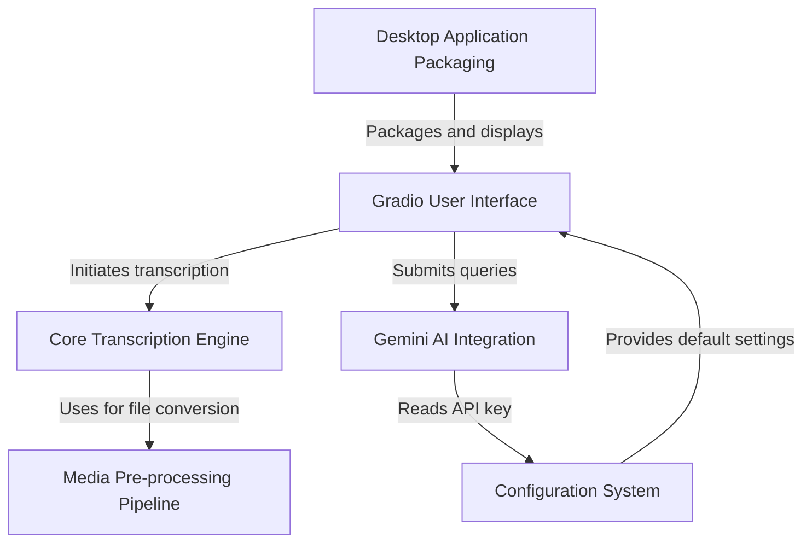

# Tutorial: whisper-utility

This project is a user-friendly **desktop application** for transcribing audio and video files. It uses the powerful *faster-whisper* model to convert speech into text through a simple interface built with **Gradio**. Users can configure settings for the transcription and even use *Google's Gemini AI* to summarize or analyze the results.

**Source Repository:** [None](None)

## Chapters

1. [Gradio User Interface
](documentation/01_gradio_user_interface_.md)
2. [Core Transcription Engine
](documentation/02_core_transcription_engine_.md)
3. [Media Pre-processing Pipeline
](documentation/03_media_pre_processing_pipeline_.md)
4. [Gemini AI Integration
](documentation/04_gemini_ai_integration_.md)
5. [Configuration System
](documentation/05_configuration_system_.md)
6. [Desktop Application Packaging
](documentation/06_desktop_application_packaging_.md)

---

Generated by [AI Codebase Knowledge Builder](https://github.com/The-Pocket/Tutorial-Codebase-Knowledge)