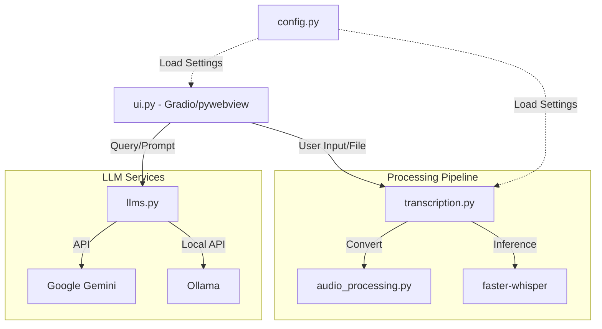

[🏠 Index](./README.md) | [Next ➡](./02-structure.md)

# Project Overview

`whisper-utility` is a desktop-based application designed to streamline the transcription of audio and video files into text, followed by intelligent processing using Large Language Models (LLMs). The project leverages `faster-whisper` for high-performance speech-to-text inference and provides a user-friendly interface built with Gradio and `pywebview`.

The utility is engineered to handle diverse input formats, including WhatsApp audio exports and various video containers, by automatically normalizing them into MP3 format before processing.

## Key Features and Capabilities

*   **High-Performance Transcription:** Utilizes `faster-whisper` to transcribe audio files with support for GPU acceleration and configurable batch sizes.
*   **Automated Preprocessing:** The `audio_processing.py` module detects file types and automatically converts WhatsApp `.opus` files and video formats into compatible MP3 audio.
*   **LLM Integration:** Seamlessly integrates with Google Gemini and local Ollama instances via `llms.py` to summarize, analyze, or query the generated transcripts.
*   **Desktop-Native Experience:** Uses `pywebview` to wrap the Gradio interface, providing a standalone application feel.
*   **Configurable Environment:** Supports granular control over transcription parameters (temperature, beam size, word timestamps) via YAML configuration files located in `settings/`.
*   **Portable Deployment:** Packaged as a standalone executable using `PyInstaller` with custom hooks for Gradio and multiprocessing support.

## Technology Stack

| Category | Technology |
| :--- | :--- |
| **Language** | Python 3.x |
| **UI Framework** | Gradio |
| **Desktop Wrapper** | pywebview |
| **Transcription Engine** | faster-whisper |
| **LLM Clients** | Google GenAI SDK, Requests (for Ollama) |
| **Packaging** | PyInstaller |
| **Configuration** | PyYAML |

## High-Level Architecture

The application follows a modular architecture where the UI layer orchestrates data flow between the audio processing pipeline, the transcription engine, and the LLM service layer.

## Component Reference

| File | Primary Responsibility |
| :--- | :--- |
| `app_main.py` | Entry point for the PyInstaller executable. |
| `ui.py` | Gradio interface definition and event handling. |
| `transcription.py` | Whisper model loading and inference execution. |
| `audio_processing.py` | File conversion logic (FFmpeg wrappers). |
| `llms.py` | API communication with Gemini and local Ollama. |
| `config.py` | YAML configuration loading and logging setup. |

## Quick Links

*   **Configuration:** See `settings/default.yaml` for default transcription parameters.
*   **Build Instructions:** Refer to `build_windows.sh` or `installer.bat` for packaging the application.
*   **Dependencies:** See `requirements_cpu.txt` or `requirements_gpu.txt` for environment setup.
*   **Hooks:** Custom PyInstaller hooks are located in `hooks/hook-gradio.py`.

[🏠 Index](./README.md) | [Next ➡](./02-structure.md)