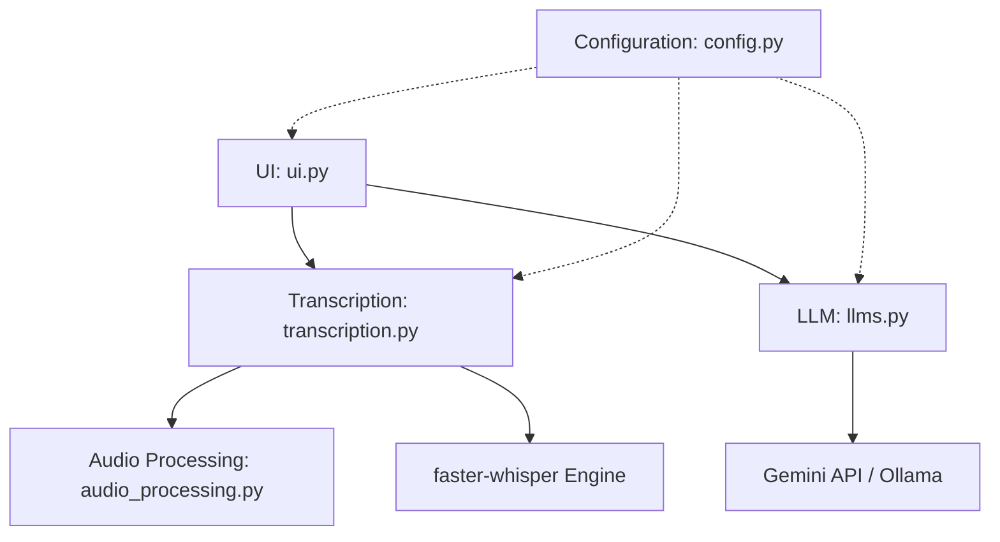

[⬅ Previous](./01-overview.md) | [🏠 Index](./README.md) | [Next ➡](./03-setup.md)

# Project Structure

The `whisper-utility` codebase is organized into a modular architecture that separates the user interface, audio processing logic, transcription engine, and LLM integration. The project is designed to be packaged as a standalone executable using PyInstaller.

## Directory Tree

```
whisper-utility/
├── default_values/
│   └── default_values.yaml
├── hooks/
│   └── hook-gradio.py
├── notebooks/
│   └── whisper_notebook.ipynb
├── settings/
│   ├── cpu.yaml
│   ├── default.yaml
│   ├── gpu.yaml
│   └── mysettings.yaml
├── .gitignore
├── app_main.py
├── audio_processing.py
├── build_windows.sh
├── config.py
├── installer.bat
├── LICENSE
├── llms.py
├── logo.ico
├── main.py
├── README.md
├── requirements_cpu.txt
├── requirements_gpu.txt
├── runtime_hook.py
├── transcription.py
├── ui.py
└── whisper.spec
```

## Logical Architecture

The application follows a layered architecture:

1.  **UI Layer (`ui.py`, `app_main.py`):** Manages the Gradio interface and application lifecycle.
2.  **Processing Layer (`transcription.py`, `audio_processing.py`):** Handles audio file conversion, FFmpeg operations, and the `faster-whisper` inference pipeline.
3.  **Integration Layer (`llms.py`):** Interfaces with external AI providers (Google Gemini) and local models (Ollama).
4.  **Configuration Layer (`config.py`, `settings/`):** Manages environment-specific settings and default values.



## Directory Descriptions

| Directory | Purpose |
| :--- | :--- |
| `default_values/` | Contains `default_values.yaml`, defining the baseline parameters for the application state. |
| `hooks/` | Contains PyInstaller hooks (e.g., `hook-gradio.py`) required to bundle dependencies correctly. |
| `notebooks/` | Sandbox environment for testing transcription logic and model performance. |
| `settings/` | Stores YAML configuration profiles for different hardware environments (CPU vs. GPU). |

## Key Files and Roles

### Core Modules

*   **`ui.py`**: The primary interface definition. It uses Gradio to build the dashboard, handles user interactions, and triggers backend functions. It includes `load_config_file`, `save_config`, and `reset_fields`.
*   **`transcription.py`**: The core engine for speech-to-text. It wraps `faster-whisper` and manages the lifecycle of audio files. Key functions include `load_model` and `transcribe_file`.
*   **`audio_processing.py`**: Utility module for media handling. It provides functions to detect file types (`is_video_file`, `is_audio_file`) and perform conversions (`convert_audio_to_mp3`, `extract_audio_from_video`).
*   **`llms.py`**: Manages AI-assisted post-processing. It handles communication with the Google Gemini API and local Ollama instances via `query_gemini` and `query_ollama`.
*   **`config.py`**: Centralized configuration management. It handles loading YAML files from the `settings/` directory and environment variable retrieval (e.g., `get_gemini_api_key`).

### Entry Points and Build Configuration

*   **`main.py`**: The standard entry point for development, importing the Gradio demo from `ui.py`.
*   **`app_main.py`**: The entry point for the packaged executable. It integrates `pywebview` to launch the Gradio app in a native window.
*   **`whisper.spec`**: The PyInstaller specification file defining how the application is bundled.
*   **`runtime_hook.py`**: A custom runtime hook used by PyInstaller to ensure `multiprocessing` behaves correctly within the frozen executable environment.
*   **`build_windows.sh`**: A shell script containing the build commands to generate the Windows executable, including necessary data collection for Gradio.

[⬅ Previous](./01-overview.md) | [🏠 Index](./README.md) | [Next ➡](./03-setup.md)