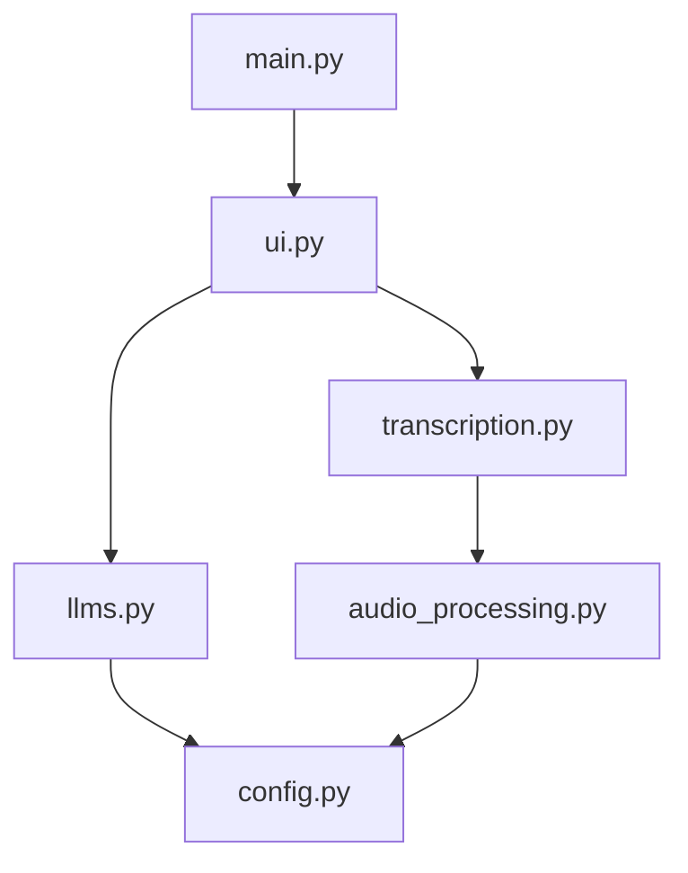

[⬅ Previous](./02-structure.md) | [🏠 Index](./README.md) | [Next ➡](./04-cli-commands.md)

# Local Development Setup Guide

This guide provides instructions for setting up the `whisper-utility` development environment. The project is a Python-based application utilizing `faster-whisper` for transcription and `gradio` for the user interface.

## Prerequisites

Ensure the following software is installed on your system before proceeding:

### Software Requirements

*   **Python 3.10+**: Required for dependency compatibility.
*   **FFmpeg**: Required for audio processing and video extraction.
    *   *Windows*: Install via `winget install ffmpeg` or download from [ffmpeg.org](https://ffmpeg.org/).
    *   *Linux*: `sudo apt install ffmpeg`
*   **Git**: For version control.
*   **Ollama** (Optional): Required only if you intend to use local LLM features.

## Installation

### 1. Clone the Repository

```bash
git clone https://github.com/your-username/whisper-utility.git
cd whisper-utility
```

### 2. Create Virtual Environment

It is recommended to use a virtual environment to manage dependencies.

```bash
# Create virtual environment
python -m venv venv

# Activate virtual environment
# Windows:
.\venv\Scripts\activate
# Linux/macOS:
source venv/bin/activate
```

### 3. Install Dependencies

The project provides separate requirement files for CPU and GPU environments. Choose the one that matches your hardware capabilities.

| Environment | Command |
| :--- | :--- |
| **CPU Only** | `pip install -r requirements_cpu.txt` |
| **GPU (CUDA)** | `pip install -r requirements_gpu.txt` |

## Configuration

The application relies on configuration files located in the `settings/` and `default_values/` directories, as well as environment variables for sensitive keys.

### Environment Variables

Create a `.env` file in the root directory to store your API keys.

```bash
# .env
GEMINI_API_KEY=your_actual_gemini_api_key_here
```

### Configuration Files

The application loads settings from YAML files. You can modify these files to change default behavior:

*   `settings/default.yaml`: Base configuration for the application.
*   `settings/cpu.yaml` / `settings/gpu.yaml`: Hardware-specific overrides.
*   `default_values/default_values.yaml`: Application-wide default constants (located inside the `default_values/` directory).

## Running the Project

The project has two distinct entry points depending on your goal:

### Development
For local development and testing, use `main.py`. This launches the Gradio interface directly.

```bash
python main.py
```
The application will be accessible at `http://127.0.0.1:7860`.

### Building
`app_main.py` is the entry point specifically configured for PyInstaller to generate the standalone executable. Do not use this for standard development.

## Architecture Overview

The following diagram illustrates the interaction between the core components:



## Testing

The project does not currently utilize a standard test runner like `pytest`. Manual verification of the core modules is recommended during development.

### Verification Steps

1.  **Audio Processing**: Verify `audio_processing.py` by running a script to convert a sample file:
    ```python
    from audio_processing import convert_audio_to_mp3
    convert_audio_to_mp3("input.wav", "output.mp3")
    ```

2.  **Transcription**: Test the `transcription.py` module by invoking `load_model` and `transcribe_file`.
    *   `transcribe_file(file_path, device, cpu_threads, num_workers, language, whisper_model, compute_type, temperature, beam_size, batch_size, condition_on_previous_text, word_timestamps)`
    *   `clear(folder_path)`: Use this to clean up temporary directories.
    *   `clear_and_close(folder_path)`: Use this to clean up and terminate the process.

3.  **LLM Integration**: Ensure `llms.py` can reach the Gemini API or local Ollama instance. The `query_gemini` function accepts the following signature:
    `query_gemini(user_input, transcription, gemini_model, provider, ollama_model)`

## Building the Executable

To generate a standalone Windows executable, you can use the provided `build_windows.sh` script or the `installer.bat` file. Alternatively, use `pyinstaller` directly:

```bash
pyinstaller app_main.py \
  --collect-data gradio \
  --collect-data gradio_client \
  --additional-hooks-dir=./hooks \
  --runtime-hook ./runtime_hook.py \
  --add-data "default_values;default_values" \
  --add-data "settings;settings" \
  --noconfirm \
  --icon=logo.ico \
  --distpath=./dist/whisper_with_cmd
```

## Troubleshooting

### FFmpeg Not Found
If the application fails to process audio/video, ensure `ffmpeg` is in your system PATH.
*   **Test**: Run `ffmpeg -version` in your terminal. If it returns an error, the path is not configured correctly.

### CUDA/GPU Errors
If you installed `requirements_gpu.txt` but the application defaults to CPU:
1.  Verify your NVIDIA drivers are up to date.
2.  Ensure `torch` is installed with CUDA support:
    ```bash
    python -c "import torch; print(torch.cuda.is_available())"
    ```
    If this returns `False`, reinstall the appropriate PyTorch version for your CUDA toolkit.

### Gradio/PyInstaller Issues
If the executable fails to launch, check the `dist/whisper_with_cmd` directory for log files. The `hooks/hook-gradio.py` and `runtime_hook.py` files are specifically designed to handle Gradio's dynamic data loading; ensure these files have not been modified.

[⬅ Previous](./02-structure.md) | [🏠 Index](./README.md) | [Next ➡](./04-cli-commands.md)