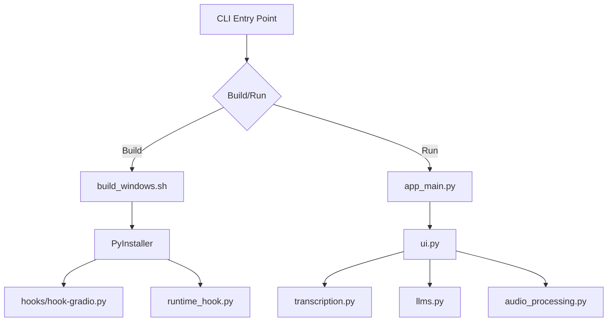

[⬅ Previous](./03-setup.md) | [🏠 Index](./README.md) | [Next ➡](./05-installation.md)

# CLI Commands Reference

The `whisper-utility` project is primarily designed as a GUI-based application using Gradio and PyWebView. However, it includes specific CLI entry points and build scripts for packaging and environment management. This reference details the commands available for building, running, and managing the utility.

## Architecture Overview

The application architecture separates the UI layer (`ui.py`) from the core processing logic (`transcription.py`, `audio_processing.py`, `llms.py`). The CLI entry points are primarily used for the PyInstaller build process and environment initialization.



## Build Commands

The project utilizes PyInstaller to bundle the application into a standalone executable. The build process is managed via shell scripts.

### `build_windows.sh`

This script automates the creation of the Windows executable. It invokes PyInstaller with specific hooks to ensure Gradio and other dependencies are correctly bundled.

**Usage:**
```bash
./build_windows.sh
```

**Internal Command Execution:**
The script executes the following PyInstaller command internally:

```bash
pyinstaller app_main.py \
  --collect-data gradio \
  --collect-data gradio_client \
  --additional-hooks-dir=./hooks \
  --runtime-hook ./runtime_hook.py \
  --add-data "default_values/default_values.yaml;default_values" \
  --add-data "settings/*.yaml;settings" \
  --noconfirm \
  --icon=logo.ico \
  --distpath=./dist/whisper_with_cmd
```

| Flag | Description |
| :--- | :--- |
| `--collect-data` | Ensures Gradio assets are included in the build. |
| `--additional-hooks-dir` | Points to `./hooks` for custom PyInstaller hooks (e.g., `hook-gradio.py`). |
| `--runtime-hook` | Executes `runtime_hook.py` to handle multiprocessing issues on Windows. |
| `--add-data` | Includes configuration files and settings YAMLs in the executable. |
| `--distpath` | Sets the output directory for the generated executable. |

## Execution Commands

### `app_main.py`

This is the primary entry point for the application. It initializes the `pywebview` window and loads the Gradio interface defined in `ui.py`.

**Usage:**
```bash
python app_main.py
```

This command launches the application window. It relies on the environment having the necessary dependencies installed (see `requirements_cpu.txt` or `requirements_gpu.txt`).

## Configuration Management

While not strictly CLI commands, the application behavior is controlled via YAML configuration files located in the `settings/` directory. These files are loaded by `config.py` functions.

### Configuration Files

| File Path | Purpose |
| :--- | :--- |
| `settings/cpu.yaml` | Configuration optimized for CPU-only inference. |
| `settings/gpu.yaml` | Configuration optimized for CUDA/GPU inference. |
| `settings/default.yaml` | Fallback configuration used if no specific settings are loaded. |
| `settings/mysettings.yaml` | User-defined overrides. |

### Configuration Loading Logic

The `config.py` module provides the following functions to interface with these files:

*   `load_default_values()`: Reads `default_values/default_values.yaml` to populate UI defaults.
*   `load_default_config()`: Reads `settings/default.yaml` to initialize the application state.
*   `setup_logging(log_file)`: Configures the logging system, clearing previous logs before initialization.

## Troubleshooting

### Build Failures
If the `build_windows.sh` script fails, verify the following:

1.  **Hooks:** Ensure `hooks/hook-gradio.py` is present and correctly configured to handle Gradio's dynamic imports.
2.  **Multiprocessing:** The `runtime_hook.py` is critical for Windows. If the application crashes immediately upon launch, ensure this file is being correctly injected by PyInstaller.
3.  **Dependencies:** Ensure the environment matches the requirements file used:
    ```bash
    # For CPU
    pip install -r requirements_cpu.txt
    # For GPU
    pip install -r requirements_gpu.txt
    ```

### Audio Processing Errors
If transcription fails, check the `audio_processing.py` logic:
*   The utility automatically detects WhatsApp audio (`.opus`) and converts it to MP3 using `convert_whatsapp_audio_to_mp3`.
*   Ensure `ffmpeg` is installed and available in the system PATH, as `extract_audio_from_video` relies on it for video processing.

---

### Why included

**Reason:** Architecture 'cli' recommends this section

**Confidence:** 100%

[⬅ Previous](./03-setup.md) | [🏠 Index](./README.md) | [Next ➡](./05-installation.md)