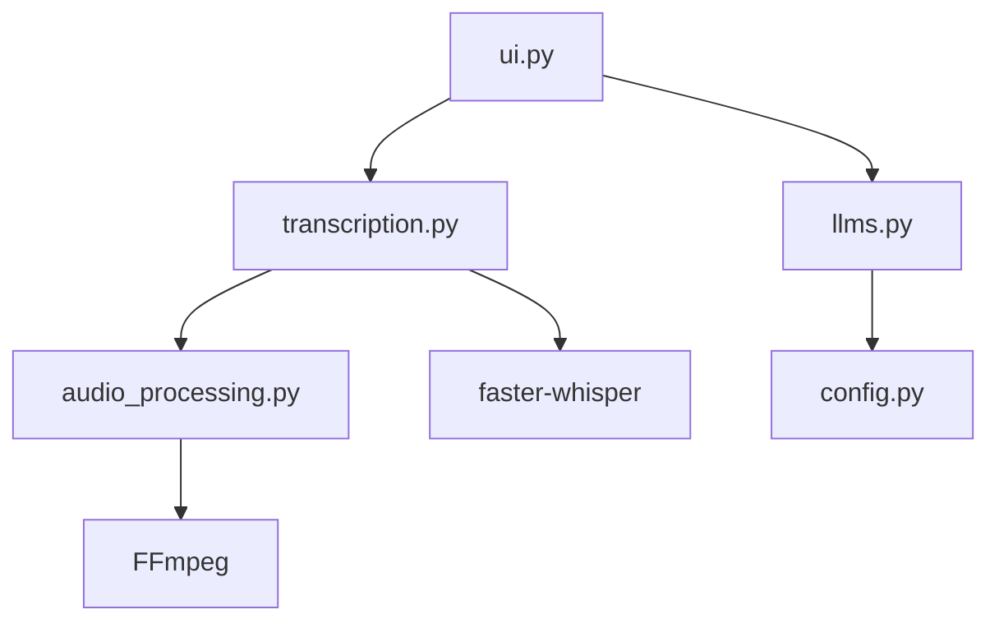

[⬅ Previous](./04-cli-commands.md) | [🏠 Index](./README.md) | [Next ➡](./06-examples.md)

# Installation

The `whisper-utility` is a Python-based application designed for local audio transcription and LLM-assisted processing. It leverages `faster-whisper` for high-performance speech-to-text and integrates with local (Ollama) or cloud (Gemini) LLMs for post-processing.

This document outlines the system requirements, environment setup, and build procedures for deploying the utility.

## System Requirements

The application supports both CPU and GPU-accelerated inference. Ensure your environment meets the following criteria before proceeding.

| Component | Requirement |
| :--- | :--- |
| **OS** | Windows 10/11 (Recommended for `.exe` builds) |
| **Python** | 3.10 or 3.11 |
| **FFmpeg** | Required for audio/video processing (must be in system PATH) |
| **Hardware (CPU)** | Minimum 8GB RAM, AVX2 support recommended |
| **Hardware (GPU)** | NVIDIA GPU with CUDA support (Compute Capability 5.0+) |

## Environment Setup

The project provides separate dependency files to optimize for hardware capabilities.

### 1. Clone the Repository
```bash
git clone https://github.com/your-org/whisper-utility.git
cd whisper-utility
```

### 2. Create Virtual Environment
It is recommended to use a virtual environment to isolate dependencies.

```bash
python -m venv venv
.\venv\Scripts\activate
```

### 3. Install Dependencies
Choose the installation path based on your hardware configuration:

**For CPU-only environments:**
```bash
pip install -r requirements_cpu.txt
```

**For GPU-accelerated environments:**
```bash
pip install -r requirements_gpu.txt
```

## Architecture Overview

The application utilizes a modular architecture where the UI layer (`ui.py`) orchestrates calls between the transcription engine (`transcription.py`) and the LLM interface (`llms.py`).



## Building the Executable

The project includes a build pipeline using `PyInstaller` to package the application into a standalone Windows executable. This process bundles the Gradio web interface and the necessary runtime hooks.

### Build Configuration
The build process is defined in `whisper.spec` and executed via `app_main.py`. The `hooks/hook-gradio.py` file ensures that Gradio's static assets are correctly included in the final bundle.

### Execution Command
To generate the executable, run the following command from the project root:

```bash
pyinstaller app_main.py ^
  --collect-data gradio ^
  --collect-data gradio_client ^
  --additional-hooks-dir=./hooks ^
  --runtime-hook ./runtime_hook.py ^
  --add-data "default_values/default_values.yaml;default_values" ^
  --add-data "settings/*.yaml;settings" ^
  --noconfirm ^
  --icon=logo.ico ^
  --distpath=./dist/whisper_with_cmd
```

*Note: The resulting executable will be located in `./dist/whisper_with_cmd/app_main.exe`.*

## Configuration

The application relies on YAML configuration files located in the `/settings` directory.

*   `settings/default.yaml`: Base configuration for application startup.
*   `settings/cpu.yaml`: Optimized settings for CPU-only inference.
*   `settings/gpu.yaml`: Optimized settings for CUDA-enabled inference.

To modify the application behavior, edit the relevant YAML file. The `config.py` module handles the loading logic:

```python
# Example: Loading configuration in the application
from config import load_default_config

config = load_default_config()
# Access parameters like config['whisper_model'] or config['device']
```

## Troubleshooting

### FFmpeg Errors
If the application fails to process audio or video files, verify that `ffmpeg` is installed and accessible in your system environment variables.
*   **Test:** Run `ffmpeg -version` in your terminal.
*   **Fix:** Download from [ffmpeg.org](https://ffmpeg.org/), extract, and add the `/bin` folder to your Windows PATH.

### Missing DLLs (GPU)
If you are using the GPU version and receive CUDA-related errors:
1.  Ensure the NVIDIA CUDA Toolkit (matching the version required by `faster-whisper`) is installed.
2.  Verify that `cudnn` is correctly configured in your system path.

### Log Files
The application generates logs to assist in debugging. If the UI fails to launch, check the log file generated by `config.setup_logging()` to identify initialization failures.

---

### Why included

**Reason:** Architecture 'cli' recommends this section

**Confidence:** 100%

[⬅ Previous](./04-cli-commands.md) | [🏠 Index](./README.md) | [Next ➡](./06-examples.md)