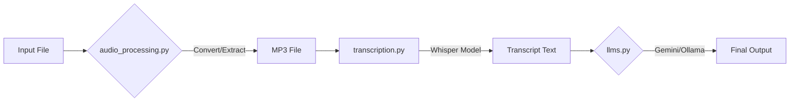

[⬅ Previous](./05-installation.md) | [🏠 Index](./README.md) | [Next ➡](./07-llm-integration.md)

# Usage Examples

The `whisper-utility` provides a modular interface for transcribing audio and video files using `faster-whisper` and processing the resulting text through LLMs like Gemini or local Ollama instances. This section details common workflows, configuration management, and integration patterns.

## Architecture Overview

The utility operates as a pipeline: input files are normalized via `audio_processing.py`, transcribed by `transcription.py`, and optionally analyzed by `llms.py`. The `ui.py` module serves as the primary controller, orchestrating these components via a Gradio interface.



## Configuration Management

The application relies on YAML configuration files located in the `settings/` directory. You can switch between hardware profiles (e.g., CPU vs. GPU) by loading different configuration files.

### Loading Configurations
The `config.py` module handles the loading of these settings. To programmatically load a specific configuration file, use the `load_config_file` function within `ui.py`.

| Function | Description |
| :--- | :--- |
| `config.load_default_config()` | Loads `settings/default.yaml`. |
| `ui.load_config_file(file_path)` | Loads a custom YAML file from the specified path. |
| `ui.save_config(...)` | Persists current UI state to the active configuration file. |

### Example: Switching to GPU Mode
To optimize performance for NVIDIA hardware, ensure your environment is set up with `requirements_gpu.txt` and load the `settings/gpu.yaml` configuration:

```python
from ui import load_config_file

# Load the GPU-optimized settings
load_config_file("settings/gpu.yaml")
```

## Audio and Video Processing

The `audio_processing.py` module automatically detects file types and normalizes them to MP3 for the Whisper engine. This is handled internally by `transcription.transcribe_file`, but can be invoked independently for batch processing.

### Supported Workflows
1.  **WhatsApp Audio:** Detected via `is_whatsapp_audio_file()`, converted via `convert_whatsapp_audio_to_mp3()`.
2.  **Video Files:** Detected via `is_video_file()`, audio extracted via `extract_audio_from_video()`.

### Example: Manual Conversion
If you need to prepare a file for transcription outside of the UI:

```python
from audio_processing import extract_audio_from_video, convert_audio_to_mp3

# Extract audio from a video file
extract_audio_from_video("input_video.mp4", "temp_audio.wav")

# Convert to MP3 for Whisper compatibility
convert_audio_to_mp3("temp_audio.wav", "final_output.mp3")
```

## Transcription Workflow

The core transcription logic resides in `transcription.py`. The `transcribe_file` function is the primary entry point, handling model loading, inference, and file cleanup.

### Parameters for `transcribe_file`

| Parameter | Type | Description |
| :--- | :--- | :--- |
| `file_path` | `str` | Path to the source media file. |
| `device` | `str` | Hardware device (`cpu` or `cuda`). |
| `whisper_model` | `str` | Model size (e.g., `large-v3`, `base`). |
| `compute_type` | `str` | Precision (e.g., `int8`, `float16`). |
| `batch_size` | `int` | Number of segments to process in parallel. |

### Example: Programmatic Transcription
```python
from transcription import transcribe_file

# Execute transcription with specific settings
transcript = transcribe_file(
    file_path="recording.mp3",
    device="cuda",
    cpu_threads=4,
    num_workers=1,
    language="en",
    whisper_model="large-v3",
    compute_type="float16",
    temperature=0.0,
    beam_size=5,
    batch_size=16,
    condition_on_previous_text=True,
    word_timestamps=True
)

print(transcript)
```

## LLM Integration

The `llms.py` module allows you to query the transcript using Gemini or local Ollama models.

### Querying Ollama
To use a local Ollama instance, ensure the Ollama daemon is running. You can list available models and query them directly.

```python
from llms import list_ollama_models, query_ollama

# 1. Verify available models
models = list_ollama_models()
print(f"Available models: {models}")

# 2. Query a specific model
response = query_ollama(
    user_input="Summarize this meeting transcript.",
    transcription="[Full text from Whisper]",
    ollama_model="llama3"
)
```

## Building the Executable

The project includes a build script for Windows environments. This uses `PyInstaller` to bundle the Gradio application and its dependencies.

### Build Command
Run the following command from the project root to generate the standalone executable:

```bash
pyinstaller app_main.py \
  --collect-data gradio \
  --collect-data gradio_client \
  --additional-hooks-dir=./hooks \
  --runtime-hook ./runtime_hook.py \
  --add-data "default_values/default_values.yaml;default_values" \
  --add-data "settings;settings" \
  --noconfirm \
  --icon=logo.ico \
  --distpath=./dist/whisper_with_cmd
```

## Troubleshooting

*   **FFmpeg Errors:** Ensure `ffmpeg` is installed and added to your system PATH. The `audio_processing.py` module relies on `subprocess` calls to `ffmpeg` for extraction and conversion.
*   **Model Loading Failures:** If `transcription.load_model` fails, verify that the `compute_type` matches your hardware capabilities (e.g., `int8` requires less VRAM than `float32`).
*   **Gemini API Key:** If `query_gemini` returns an error, ensure the `GEMINI_API_KEY` environment variable is correctly set in your system environment or `.env` file. Use `config.get_gemini_api_key()` to verify the application can read it.

---

### Why included

**Reason:** Architecture 'cli' recommends this section

**Confidence:** 100%

[⬅ Previous](./05-installation.md) | [🏠 Index](./README.md) | [Next ➡](./07-llm-integration.md)