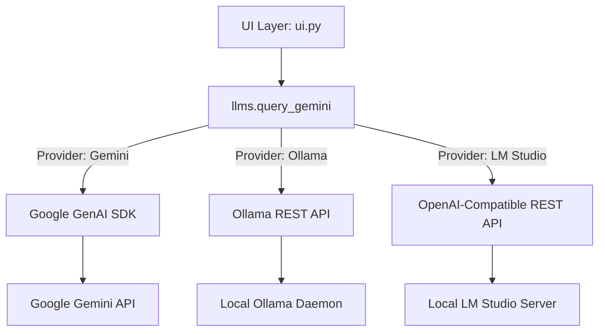

[⬅ Previous](./06-examples.md) | [🏠 Index](./README.md) | [Next ➡](./08-transcription-engine.md)

# LLM Integration

The `whisper-utility` application integrates with Large Language Models (LLMs) to process, summarize, and analyze transcriptions generated by the Whisper engine. The system supports both cloud-based providers (Google Gemini) and local inference engines (Ollama) to provide flexibility based on privacy requirements and hardware availability.

## Architecture

The LLM integration layer acts as a bridge between the transcription output and the inference provider. The architecture utilizes a provider-agnostic dispatch pattern, allowing the UI to request processing without needing to manage the underlying API complexities of specific LLM backends.

The application entry point is `main.py`, which initializes the UI and connects the transcription pipeline (managed in `transcription.py`) to the LLM dispatchers in `llms.py`.



## Component Details

The core logic resides in `llms.py`. This module handles client initialization, configuration retrieval, and request dispatching.

### Initialization and Configuration

The system relies on `config.py` to manage API keys and model preferences.

*   **`initialize_client()`**: Establishes the connection to the Google Gemini API. It retrieves the API key via `config.get_gemini_api_key()` and instantiates the `google.genai.Client`.
*   **`get_gemini_config()`**: Returns the generation configuration parameters (e.g., temperature, top_p) defined in the application settings.

### Query Dispatching

The primary entry point for LLM interaction is `query_gemini`. This function acts as a dispatcher, abstracting the provider selection logic.

#### `query_gemini(user_input, transcription, gemini_model, provider, ollama_model)`

| Parameter | Type | Description |
| :--- | :--- | :--- |
| `user_input` | `str` | The prompt or instruction provided by the user. |
| `transcription` | `str` | The raw text output from the Whisper transcription process. |
| `gemini_model` | `str` | The specific Gemini model identifier (e.g., `gemini-1.5-flash`). |
| `provider` | `str` | The selected backend: `"Gemini"`, `"Ollama"`, or `"LM Studio"`. |
| `ollama_model` | `str` | The local model identifier if `provider` is set to `"Ollama"`. |
| `lmstudio_model` | `str` | The local model identifier if `provider` is set to `"LM Studio"`. |

### Local Inference (Ollama)

The application supports local LLM execution via the Ollama REST API.

*   **`list_ollama_models()`**: Queries the local Ollama daemon (typically running on `http://localhost:11434`) to retrieve a list of available models. This is used to populate the UI dropdown menus.
*   **`query_ollama(user_input, transcription, ollama_model)`**: Sends a POST request to the Ollama `/api/generate` endpoint. This function handles the NDJSON stream response, concatenating partial `response` fields into a single coherent string.

### Local Inference (LM Studio)

The application supports local inference via LM Studio using its OpenAI-compatible REST API.

*   **`list_lmstudio_models()`**: Queries the local LM Studio server (typically on `http://localhost:1234`) via `/v1/models` to retrieve the list of currently loaded or available models.
*   **`query_lmstudio(user_input, transcription, lmstudio_model)`**: Sends a POST request to the LM Studio `/v1/chat/completions` endpoint. This uses a standard chat interface with system and user messages.

### Data Flow from Transcription

The `transcription.py` module provides the raw text data that is passed to the LLM functions. Key utility functions in `transcription.py` (such as those handling audio file processing and Whisper model inference) prepare the `transcription` string. This string is then passed directly into `llms.query_gemini` to serve as the context for user prompts.

## Configuration Requirements

To enable LLM features, ensure the following configurations are set in your `settings/` files (e.g., `settings/mysettings.yaml`). Additionally, ensure that the required dependencies are installed via `requirements_cpu.txt` or `requirements_gpu.txt`, which include the `google-genai` library.

### Gemini Setup
You must provide a valid Google AI Studio API key.

```yaml
# settings/mysettings.yaml
gemini_api_key: "AIzaSy..."
gemini_model: "gemini-1.5-flash"
```

### Ollama Setup
Ensure the Ollama daemon is running locally before launching the application. The application expects the default Ollama port.

1.  **Start Ollama:**
    ```bash
    ollama serve
    ```
2.  **Verify Models:**
    Ensure you have pulled the desired models:
    ```bash
    ollama pull llama3
    ```

### LM Studio Setup
Ensure the LM Studio Local Server is running.

1.  **Start Local Server:**
    Open LM Studio and click on the **Local Server** icon on the sidebar.
    Ensure 'Local Server' is **ON** (default port `1234`).
2.  **Load a Model:**
    Select and load a model in the LM Studio interface before querying.

## Troubleshooting

### Connection Errors
If `query_ollama` fails, verify the local daemon status:

*   **Check Port:** Ensure `http://localhost:11434` is reachable.
*   **Model Availability:** Use `list_ollama_models()` to verify the application can communicate with the daemon. If the list is empty, the daemon may be unreachable or no models are installed.

### Gemini API Errors
*   **Invalid Key:** Ensure `config.get_gemini_api_key()` returns a valid string.
*   **Quota Limits:** If the API returns 429 errors, verify your Google Cloud project quota in the Google AI Studio console.

---

### Why included

**Reason:** The project integrates multiple LLM providers, which requires specific API keys, environment variables, or local server configurations that users need to understand to enable AI features.

**Confidence:** 75%


**Evidence:**

- `llms.py`: llms.py

- `class GeminiClient`: class GeminiClient

- `class OllamaClient`: class OllamaClient

[⬅ Previous](./06-examples.md) | [🏠 Index](./README.md) | [Next ➡](./08-transcription-engine.md)