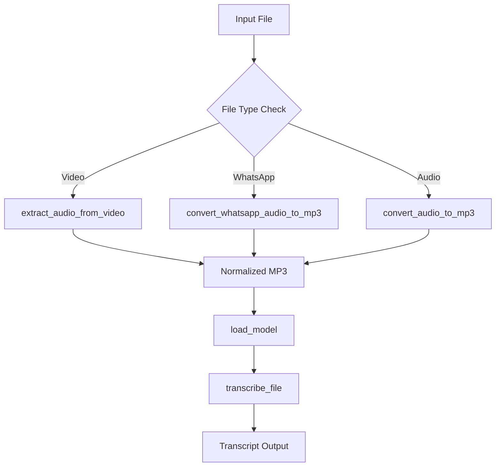

[⬅ Previous](./07-llm-integration.md) | [🏠 Index](./README.md) | [Next ➡](./09-packaging-and-distribution.md)

# Transcription Engine

The Transcription Engine serves as the core processing unit of `whisper-utility`. It leverages the `faster-whisper` library to provide high-performance, optimized speech-to-text capabilities. The engine is designed to handle diverse input formats—including video files, WhatsApp audio, and standard audio files—by normalizing them into a compatible format before passing them to the inference pipeline.

## Architecture Overview

The engine operates as a sequential pipeline. It first validates and prepares the input media, then initializes the `faster-whisper.WhisperModel` based on user-defined hardware and model constraints, and finally executes the transcription process.



## Core Components

The engine logic is encapsulated within `transcription.py`.

### Model Initialization

The `load_model` function is responsible for instantiating the `faster-whisper.WhisperModel`. This function abstracts the complexity of hardware-specific configurations, such as thread allocation and compute precision.

**Function Signature:**
```python
def load_model(model_size, compute_type, device, cpu_threads, num_workers)
```

| Parameter | Description |
| :--- | :--- |
| `model_size` | The Whisper model variant (e.g., "base", "small", "medium", "large-v3"). |
| `compute_type` | Precision mode (e.g., "int8", "float16", "float32"). |
| `device` | Hardware target ("cpu" or "cuda"). |
| `cpu_threads` | Number of threads to use for CPU inference. |
| `num_workers` | Number of parallel workers for batch processing. |

### Transcription Pipeline

The `transcribe_file` function manages the end-to-end lifecycle of a transcription request. It handles pre-processing, model inference, and file cleanup.

**Function Signature:**
```python
def transcribe_file(file_path, device, cpu_threads, num_workers, language, whisper_model, compute_type, temperature, beam_size, batch_size, condition_on_previous_text, word_timestamps)
```

The pipeline performs the following steps:
1. **Pre-processing:** Calls `audio_processing.py` utilities to ensure the input is a valid MP3.
2. **Inference:** Executes `whisper_model.transcribe()` using the provided configuration parameters.
3. **Output:** Generates the transcript file and returns the result string.

## Configuration and Hardware Acceleration

The engine supports dynamic configuration via YAML files located in the `settings/` directory. Users can toggle between CPU and GPU acceleration by modifying the `device` parameter.

### Hardware Settings

*   **GPU Acceleration:** When `device` is set to `cuda`, the engine utilizes `faster-whisper`'s optimized CUDA kernels. Ensure the appropriate `requirements_gpu.txt` dependencies are installed.
*   **CPU Optimization:** When `device` is set to `cpu`, the `cpu_threads` parameter directly influences the `faster-whisper` initialization, allowing for fine-tuned performance on multi-core processors.

### Example Configuration (`settings/mysettings.yaml`)

```yaml
model_size: "large-v3"
compute_type: "int8"
device: "cuda"
cpu_threads: 4
num_workers: 1
beam_size: 5
batch_size: 16
```

## Usage Example

To invoke the transcription engine programmatically within the application, use the following pattern:

```python
from transcription import load_model, transcribe_file

# 1. Load the model
model = load_model(
    model_size="small",
    compute_type="int8",
    device="cpu",
    cpu_threads=4,
    num_workers=1
)

# 2. Transcribe
result = transcribe_file(
    file_path="audio_input.mp3",
    device="cpu",
    cpu_threads=4,
    num_workers=1,
    language="en",
    whisper_model=model,
    compute_type="int8",
    temperature=0.0,
    beam_size=5,
    batch_size=16,
    condition_on_previous_text=True,
    word_timestamps=False
)
```

## Troubleshooting

*   **Memory Errors:** If encountering `OutOfMemory` errors on GPU, reduce the `batch_size` or switch `compute_type` to `int8`.
*   **Slow Transcription:** If CPU usage is high but transcription is slow, adjust `cpu_threads` to match the physical core count of the host machine.
*   **File Format Issues:** If the engine fails to process a file, verify that `ffmpeg` is installed and accessible in the system PATH, as `audio_processing.py` relies on it for conversion tasks.

---

### Why included

**Reason:** The core value of the application is transcription. Users need to know how to configure model sizes (e.g., tiny, base, large) and device settings (CPU vs GPU) to optimize performance.

**Confidence:** 75%


**Evidence:**

- `transcription.py`: transcription.py

- `from faster_whisper import WhisperModel`: from faster_whisper import WhisperModel

[⬅ Previous](./07-llm-integration.md) | [🏠 Index](./README.md) | [Next ➡](./09-packaging-and-distribution.md)