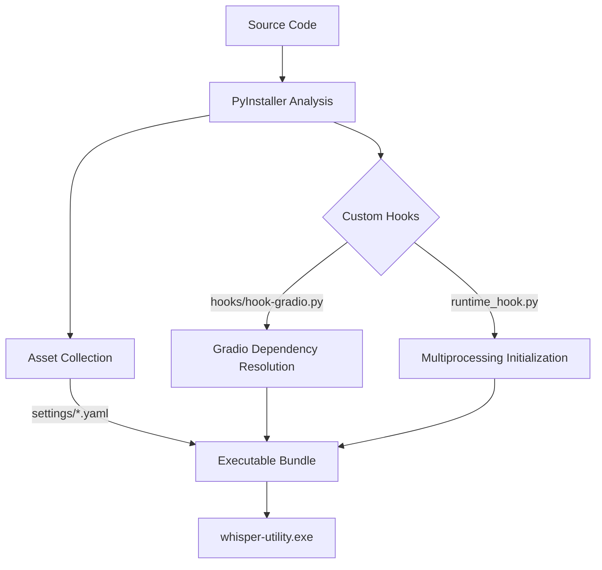

[⬅ Previous](./08-transcription-engine.md) | [🏠 Index](./README.md)

# Packaging and Distribution

This section details the build process for `whisper-utility`, transforming the Python source code into a standalone executable for Windows. The project utilizes PyInstaller to bundle the application, including custom hooks to manage Gradio's complex dependency tree and runtime environment requirements.

## Build Architecture

The packaging process relies on a custom `whisper.spec` file that orchestrates the inclusion of static assets (YAML configurations, icons) and runtime hooks. Because Gradio dynamically loads dependencies and assets, standard PyInstaller analysis often fails to capture the necessary files. We address this using a custom hook located in `hooks/hook-gradio.py`.

### Build Flow

The following diagram illustrates the build pipeline:



## Configuration and Hooks

### Custom Gradio Hook

Gradio requires specific static files and templates to function outside of a standard Python environment. The `hooks/hook-gradio.py` file ensures these are included in the `datas` list during the PyInstaller build process.

**File:** `hooks/hook-gradio.py`

```python
from PyInstaller.utils.hooks import collect_data_files

# Collect all Gradio static assets and templates
datas = collect_data_files('gradio')
```

### Runtime Environment Management

To prevent issues with multiprocessing (often triggered by `faster-whisper` or `gradio` background tasks) when running as a frozen executable, we utilize a runtime hook. This ensures the multiprocessing module is correctly initialized before the main application logic executes.

**File:** `runtime_hook.py`

```python
import multiprocessing
import sys

# Ensure multiprocessing works correctly in frozen executables
if sys.platform.startswith('win'):
    multiprocessing.freeze_support()
```

## Core Application Modules

The build process bundles several critical modules that handle the core logic of the application. When modifying these, ensure that all dependencies are reflected in the `requirements_cpu.txt` or `requirements_gpu.txt` files to ensure they are included in the build environment.

*   **`app_main.py`**: The primary entry point for the application.
*   **`transcription.py`**: Contains the core logic for audio processing and transcription. Key functions include `process_audio()` and `transcribe_file()`, which interface with `faster-whisper`.
*   **`audio_processing.py`**: Handles audio file loading, normalization, and format conversion utilities.
*   **`config.py`**: Manages the loading and parsing of YAML configuration files from the `settings/` directory.
*   **`llms.py`**: Handles integration with external LLM providers. This includes the `query_gemini(prompt: str, model: str)` function.
*   **`ui.py`**: Defines the Gradio interface layout and event handlers.

## Build Process

The build process is automated via `build_windows.sh` (for Git Bash/Linux environments) or `installer.bat` (for native Windows execution). These scripts invoke PyInstaller using the `whisper.spec` configuration file.

### Spec File Configuration

The `whisper.spec` file defines the entry point and the inclusion of external configuration files located in the `settings/` directory.

**Key configurations in `whisper.spec`:**

| Parameter | Value | Description |
| :--- | :--- | :--- |
| `scripts` | `['app_main.py']` | The entry point of the application. |
| `datas` | `[('settings/*.yaml', 'settings'), ('default_values/*.yaml', 'default_values')]` | Includes configuration files in the bundle. |
| `runtime_hooks` | `['runtime_hook.py']` | Executes before the main script to fix multiprocessing. |
| `hookspath` | `['hooks']` | Points to the directory containing `hook-gradio.py`. |

### Execution

To build the application, execute the appropriate build script from the project root:

```bash
# Execute the build script for Windows
./installer.bat
```

This command performs the following actions:
1. Cleans previous `dist/` and `build/` directories.
2. Runs `pyinstaller whisper.spec`.
3. Packages the resulting `whisper-utility.exe` with the necessary `settings/` and `default_values/` folders.

## Troubleshooting

### Gradio UI Fails to Load

If the application launches but the Gradio interface does not render, verify that the `hook-gradio.py` is correctly referenced in the `whisper.spec` file. Ensure the `hookspath` variable in the spec file points to the absolute or relative path of the `hooks/` directory.

### Multiprocessing Errors

If the application crashes immediately upon starting a transcription task, verify that `runtime_hook.py` is included in the `runtime_hooks` list within `whisper.spec`. This is critical for Windows executables to handle the `multiprocessing` module's `freeze_support()` requirement.

### Missing Configuration Files

If the application throws `FileNotFoundError` when attempting to load settings, ensure the `datas` tuple in `whisper.spec` correctly maps the source directory to the destination directory:

```python
# Example of correct mapping in whisper.spec
datas=[
    ('settings/*.yaml', 'settings'),
    ('default_values/*.yaml', 'default_values')
]
```

This ensures that when the executable runs, it can locate the YAML files relative to the `_internal` or root directory of the bundle.

---

### Why included

**Reason:** The project includes custom PyInstaller hooks and runtime configurations. Contributors or users building from source need to understand the build process to ensure dependencies like Gradio are correctly bundled.

**Confidence:** 75%


**Evidence:**

- `runtime_hook.py`: runtime_hook.py

- `hooks/hook-gradio.py`: hooks/hook-gradio.py

[⬅ Previous](./08-transcription-engine.md) | [🏠 Index](./README.md)