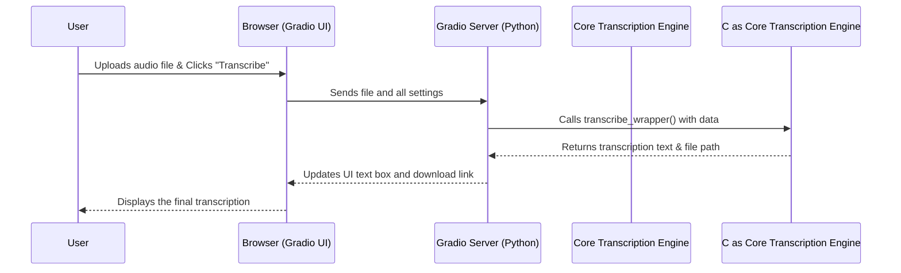

# Chapter 1: Gradio User Interface

Welcome to the `whisper-utility` project! This series of tutorials will walk you through how this powerful transcription application works, piece by piece. We're starting at the most visible part: the user interface.

Imagine you've built a super-powerful car engine. It's fast and efficient, but without a steering wheel, pedals, or a dashboard, nobody can drive it. How do you make that powerful engine accessible to everyone?

This is the exact problem our Gradio User Interface (UI) solves. It acts as the "dashboard" for our powerful transcription engine, providing all the buttons, sliders, and text boxes you need to control it without writing a single line of code. It's the friendly face of our application, making complex AI technology simple to use.

In this chapter, we'll explore how this user interface is built and how it connects your clicks to the core logic of the application.

## How it All Starts: Launching the App

When you run `whisper-utility`, the very first thing that happens is a simple command that brings the UI to life. This is handled by our main script, `main.py`.

```python
# File: main.py
from ui import demo

if __name__ == "__main__":
    demo.launch(debug=True)
```

This tiny script does one crucial thing:
1.  It imports an object named `demo` from our `ui.py` file. This `demo` object *is* our entire user interface.
2.  It calls `demo.launch()`. This command tells the Gradio library to start a local web server, build the user interface you designed, and open it in your web browser.

Just like that, our application's control panel is up and running!

## Building the Interface: A Canvas and Components

So, what is this `demo` object? Think of it as a blank canvas. We use the Gradio library to add components to this canvas, like paint on a palette. This happens inside the `ui.py` file.

The basic structure looks like this:

```python
# File: ui.py
import gradio as gr

# ... other functions and setup code ...

with gr.Blocks() as demo:
    gr.Markdown("# 🎤 Audio/Video Transcription using Whisper Model")

    file_input = gr.File(label="Upload an audio or video file")
    
    transcribe_button = gr.Button("Transcribe", variant="secondary")
```

Let's break this down:
-   `with gr.Blocks() as demo:`: This creates our "canvas" and calls it `demo`. Everything we define inside this block will become part of our user interface.
-   `gr.Markdown(...)`: This is like a text tool. It adds a title to our UI.
-   `gr.File(...)`: This creates the file upload box you see on the screen. We store it in a variable called `file_input` so we can refer to it later.
-   `gr.Button(...)`: This creates a clickable button with the label "Transcribe". We name it `transcribe_button`.

Every slider, dropdown, and checkbox in the application is created with a similar one-line command. Gradio handles all the complex web code behind the scenes.

## The Magic Connection: How a Click Triggers an Action

We have a button, but how does the application know what to do when you click it? This is where the real magic happens. We connect our UI components to Python functions using event listeners, like `.click()`.

Let's look at the "Transcribe" button again.

```python
# File: ui.py

# ... UI components are defined above, including:
# file_input, device, language, whisper_model, etc.
# output_text, download_output

transcribe_button.click(
    fn=transcribe_wrapper,
    inputs=[file_input, device, ...],
    outputs=[output_text, download_output, ...]
)
```

This `.click()` method is the bridge between the UI and our backend logic. It says:
1.  **`fn=transcribe_wrapper`**: When this button is clicked, run the Python function named `transcribe_wrapper`. This function contains the logic to start the transcription.
2.  **`inputs=[...]`**: Before you run the function, gather the current values from all the UI components in this list (like the uploaded file, the selected language, the chosen model) and pass them as arguments to the function.
3.  **`outputs=[...]`**: After the function finishes and returns some results (like the transcribed text and a path to a downloadable file), take those results and update the UI components in this list.

This input-function-output pattern is the fundamental concept behind Gradio and our entire user interface.

### What Happens Under the Hood?

Let's trace the journey of a single "Transcribe" click from start to finish.



1.  The user clicks the "Transcribe" button in their web browser.
2.  The browser sends the uploaded file and all the configuration settings to the Gradio server running on your computer.
3.  The Gradio server receives this data and calls the `transcribe_wrapper` function, passing the file and settings as arguments.
4.  The `transcribe_wrapper` function calls the main transcription logic, which is part of the [Core Transcription Engine](02_core_transcription_engine_.md).
5.  After a few moments, the engine finishes and returns the final text and a path to a results file.
6.  Gradio takes these return values and automatically updates the "Transcription" text box and the "Download Transcript" link in the browser.

### The Wrapper Function

You might have noticed we call `transcribe_wrapper` and not `transcribe_file` directly. This small "wrapper" function acts as a helpful middleman between Gradio and our core engine.

```python
# File: ui.py

def transcribe_wrapper(file, device, ...):
    # Calls the main transcription function from our engine
    transcription, output_path, folder_path = transcribe_file(
        file, device, ...
    )
    # Returns the results in the exact order Gradio expects
    return transcription, output_path, folder_path
```

Its only job is to call the real transcription function and then return the results in the precise order that matches the `outputs` list in our `.click()` event. This keeps our UI code clean and separate from the core processing logic.

## Conclusion

In this chapter, we peeled back the curtain on the `whisper-utility` user interface. We learned that Gradio provides a simple yet powerful way to build a "dashboard" for our Python code. By defining UI components and connecting them to functions with event listeners like `.click()`, we create an intuitive bridge between the user and the complex transcription engine.

You now understand how uploading a file and clicking a button triggers a chain of events that flows from the browser, through the Gradio server, to our Python code, and back again with the results.

But what actually happens inside that `transcribe_file` function? What is the engine that does all the heavy lifting? We'll dive into that next.

Ready to look under the hood? Let's proceed to the [Chapter 2: Core Transcription Engine](02_core_transcription_engine_.md).

---

Generated by [AI Codebase Knowledge Builder](https://github.com/The-Pocket/Tutorial-Codebase-Knowledge)