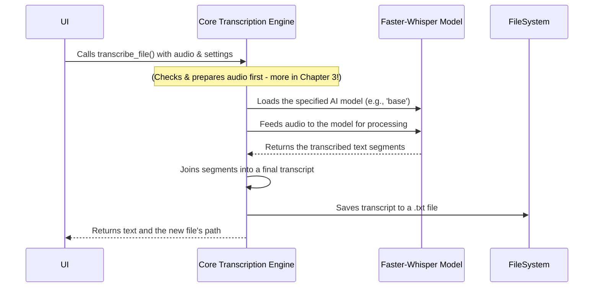

# Chapter 2: Core Transcription Engine

In the [previous chapter](01_gradio_user_interface_.md), we explored the application's "dashboard"—the Gradio UI that lets you control everything. We saw how clicking the "Transcribe" button sends your file and settings off to a function called `transcribe_file`.

But what happens next? Where does the real magic of turning speech into text occur? Welcome to the engine room! This chapter dives into the heart of our application: the Core Transcription Engine.

Think of it this way: if the UI is the steering wheel and pedals of a car, the Core Transcription Engine is the powerful motor under the hood that actually does the work. It's a highly skilled typist who listens to your audio file and writes down every word with incredible speed and accuracy.

## The Central Task: From Sound to Text

The main job of our engine is simple to describe but complex to execute: take an audio file and convert it into a written transcript.

Imagine you have a 30-minute recording of a meeting. The engine's task is to "listen" to that entire recording and produce a text file containing everything that was said. This is handled by a single, powerful function in our `transcription.py` file.

```python
# File: transcription.py

def transcribe_file(file_path, device, language, whisper_model, ...):
    # ... magic happens here ...
    
    # Returns the final text, a path to the saved file, and the folder
    return transcription, output_path, folder_path
```

This function is the main entry point to our engine. The Gradio UI calls it, passing along the path to your uploaded file (`file_path`) and all the settings you chose, like the language and model size.

## The Key Ingredient: The AI Model

How can a computer "listen" and understand speech? It uses a special kind of AI called a "model." Our engine uses a state-of-the-art model called `faster-whisper`.

Think of this model as the engine's "brain." It has been trained by listening to hundreds of thousands of hours of audio from the internet, learning to connect sounds to words, just like a human does.

Our application first needs to load this brain into memory. This is done by a helper function called `load_model`.

```python
# File: transcription.py

def load_model(model_size, compute_type, device, ...):
    """Load the Whisper model with the specified parameters."""
    logging.info(f"Loading model: {model_size}...")
    
    # This line downloads and prepares the AI model
    model = WhisperModel(model_size, device=device, ...)
    
    logging.info("Model loaded successfully.")
    return model
```

When `transcribe_file` is called, its first step is to call `load_model`, telling it which size of the model you selected in the UI (e.g., `tiny`, `small`, `base`, `medium`, or `large`).

*   A **small** model is fast but less accurate (like a junior typist).
*   A **large** model is slower but much more accurate (like a senior stenographer).

## Under the Hood: The Transcription Process

Once the model is loaded, the engine is ready to work. Let's walk through what happens step-by-step when you ask it to transcribe a file.



1.  **Receive the Job:** The `transcribe_file` function receives the audio file and your settings from the UI.
2.  **Prepare the Audio:** The engine first makes sure the audio is in a standard format (`.mp3`). If you upload a video (`.mp4`) or a special audio format (`.ogg`), it quickly converts it. We'll explore this fascinating step in the [next chapter](03_media_pre_processing_pipeline_.md).
3.  **Load the Brain:** It calls `load_model` to get the correct `faster-whisper` model ready.
4.  **Listen and Transcribe:** This is the core step. The engine feeds the prepared audio file to the model.

    ```python
    # File: transcription.py
    
    # The 'model' object is the loaded AI brain
    segments, info = model.transcribe(
        file_path,
        language=language,
        beam_size=beam_size,
        # ... other settings ...
    )
    ```
    The model processes the audio and returns a list of "segments." Each segment is a small piece of the transcription, like a sentence or a phrase.

5.  **Assemble the Transcript:** The engine takes all these small text segments and joins them together to form the complete, final transcription.

    ```python
    # File: transcription.py

    # Joins all the text from each segment with a new line
    transcription = "\n".join(segment.text for segment in segments)
    ```

6.  **Save the Result:** A good typist always saves their work! The engine saves the final text into a new `.txt` file in the same folder as your original media.

    ```python
    # File: transcription.py

    # Creates a path for the new text file
    output_path = os.path.join(folder_path, f"{filename}_transcript.txt")
    
    # Writes the transcription text into the file
    with open(output_path, "w", encoding="utf-8") as f:
        f.write(transcription)
    ```

7.  **Report Back:** Finally, the engine returns the complete transcription text and the path to the newly created `.txt` file back to the Gradio UI, which then displays it on your screen.

## Conclusion

You've now seen the powerhouse at the center of `whisper-utility`. The Core Transcription Engine is not just one thing, but a well-orchestrated process:
- It **loads** a powerful `faster-whisper` AI model.
- It **feeds** a prepared audio file to the model.
- It **assembles** the model's output into a coherent text.
- It **saves** the final transcript for you to use.

This engine is the reason our application can turn spoken words into written text. It acts as the bridge between raw audio and a useful, readable document.

But you might have noticed a small but crucial step we mentioned: "preparing the audio." The `faster-whisper` model is like a picky eater; it prefers its audio in a very specific format. What happens if you give it a video file, or a strange audio file from WhatsApp? How does the application handle that?

That's the job of our next component. Let's move on to explore the clever system that prepares any media file for our engine: [Chapter 3: Media Pre-processing Pipeline](03_media_pre_processing_pipeline_.md).

---

Generated by [AI Codebase Knowledge Builder](https://github.com/The-Pocket/Tutorial-Codebase-Knowledge)