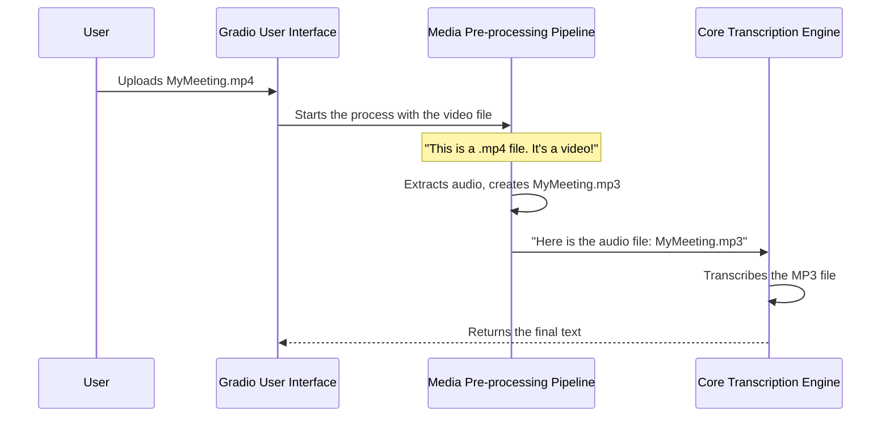

# Chapter 3: Media Pre-processing Pipeline

In the [previous chapter](02_core_transcription_engine_.md), we explored the powerful `faster-whisper` model that acts as our application's engine. We learned that this engine is an expert at turning audio into text. However, like many experts, it has a specific preference: it only wants to work with standard audio files, ideally in MP3 format.

But what happens if you want to transcribe a video of a lecture, or a voice note a friend sent you on WhatsApp? You shouldn't have to manually convert the file first. The application should be smart enough to handle it for you.

This is where the Media Pre-processing Pipeline comes in. It's the application's helpful and versatile assistant. Its job is to take *any* media file you provide, inspect it, and prepare it perfectly before handing it over to the main transcription engine. It ensures that no matter what you upload, the engine gets exactly what it needs.

## The Problem: One Box, Many File Types

Our user interface has a single "Upload a file" box. People can drop anything into it:
- A `.mp4` video recording of a family event.
- A `.mov` screen recording from a Mac.
- A `.wav` high-quality audio recording from a podcast.
- An `.opus` voice note from a chat app.
- A standard `.mp3` music file.

If we sent these files directly to our transcription engine, it would get confused and likely produce an error. The engine is a specialist in audio, not video or compressed voice formats. The pipeline solves this by acting as a universal adapter.

## The Pipeline's Workflow: Inspect, Convert, and Pass

Think of the pipeline as a three-step assembly line that prepares your file for the main event.

1.  **Inspect:** The moment a file arrives, the pipeline looks at its file extension (the part after the dot, like `.mp4` or `.opus`). This tells it what kind of file it is.
2.  **Convert:** Based on the file type, it takes a specific action:
    *   **If it's a video file (`.mp4`, `.mov`):** It carefully extracts *only the audio track* and saves it as a new MP3 file. It ignores the visual part completely.
    *   **If it's a non-MP3 audio file (`.wav`, `.opus`):** It converts the audio into the standard MP3 format.
    *   **If it's already an MP3 file:** Great! No work is needed. It's ready to go.
3.  **Pass:** It takes the path to the newly created (or original) MP3 file and hands it off to the [Core Transcription Engine](02_core_transcription_engine_.md) to begin the real work.

### A Journey Through the Pipeline

Let's trace what happens when you upload a video file named `MyMeeting.mp4`.



The user never sees the intermediate `MyMeeting.mp3` file. For them, the process is seamless. They upload a video and get back a text transcript. The pipeline does all the clever work in the background.

## Under the Hood: The Code that Does the Work

This entire process is orchestrated within our main `transcribe_file` function in `transcription.py`. It acts as the manager, calling on specialized helper functions from `audio_processing.py` to get the job done.

Here is the simplified logic from the "manager" function:

```python
# File: transcription.py

def transcribe_file(file_path, ...):
    # ...
    
    # Create a name for the new potential MP3 file
    audio_file = os.path.splitext(file_path)[0] + ".mp3"

    if is_video_file(file_path):
        extract_audio_from_video(file_path, audio_file)
        file_path = audio_file  # Update the path to the new MP3
    
    elif is_whatsapp_audio_file(file_path):
        convert_whatsapp_audio_to_mp3(file_path, audio_file)
        file_path = audio_file  # Update the path
    
    # ... now, transcribe the final file_path ...
```

This code block is like a decision tree. It asks a series of questions ("Is it a video? Is it a WhatsApp file?") and calls the correct helper for each case. Once a conversion happens, it smartly updates the `file_path` variable to point to the new MP3 file before proceeding to transcription.

Let's meet the specialists from `audio_processing.py`.

### Specialist 1: The File Inspector

How do we know if a file is a video? The `is_video_file` function is a simple detective that just looks at the file's extension.

```python
# File: audio_processing.py

def is_video_file(file_path):
    """Checks if the file is a video based on its extension."""
    video_extensions = ['.mp4', '.mov', '.avi', '.mkv']
    file_extension = os.path.splitext(file_path)[1].lower()
    return file_extension in video_extensions
```

This function takes the file path, extracts the extension (e.g., `.mp4`), and checks if it's in our list of known video types. It returns `True` or `False`.

### Specialist 2: The Audio Extractor

If the file is a video, we call `extract_audio_from_video`. This function uses a powerful, industry-standard command-line tool called **FFmpeg**. Our Python script simply tells FFmpeg what to do.

```python
# File: audio_processing.py
import subprocess

def extract_audio_from_video(video_file, output_audio_file):
    """Extracts audio from a video file using ffmpeg."""
    command = [
        'ffmpeg', '-i', video_file,  # Input file
        '-q:a', '0', '-map', 'a',     # Extract best quality audio
        output_audio_file, '-y'      # Output file (overwrite if exists)
    ]
    subprocess.run(command)
```

Think of our Python code as a manager telling a highly skilled worker (FFmpeg) to "take this video and give me only the audio track." FFmpeg handles all the complex video processing for us.

### Specialist 3: The Audio Converter

If the file is an audio format like `.wav` or `.opus`, we need to convert it. For this, we use a wonderful Python library called **pydub**.

```python
# File: audio_processing.py
from pydub import AudioSegment

def convert_audio_to_mp3(audio_file, output_audio_file):
    """Converts an audio file to MP3 format."""
    # Load the original audio file
    audio = AudioSegment.from_file(audio_file)
    # Export it in the MP3 format
    audio.export(output_audio_file, format="mp3")
```

`pydub` makes audio manipulation incredibly simple. With just two lines of code, it can read almost any audio format and save it as a standard MP3, ready for our engine.

## Conclusion

In this chapter, we've unveiled the invisible but essential work of the Media Pre-processing Pipeline. It's the unsung hero that makes our application so flexible and user-friendly.

You've learned that:
- The pipeline acts as a **universal adapter**, preparing any media file for transcription.
- It follows a simple **inspect-convert-pass** workflow.
- It uses powerful, specialized tools like **FFmpeg** for video and **pydub** for audio to do the heavy lifting.

Thanks to this pipeline, the user doesn't need to be a media expert. They can simply provide their file, and our application intelligently figures out the rest.

Now that we have a robust system for getting a clean text transcription, what else can we do with that text? What if we could ask an AI to summarize it, find key topics, or answer questions about it? That's where our next component comes in.

Let's explore how we can add another layer of intelligence in [Chapter 4: Gemini AI Integration](04_gemini_ai_integration_.md).

---

Generated by [AI Codebase Knowledge Builder](https://github.com/The-Pocket/Tutorial-Codebase-Knowledge)