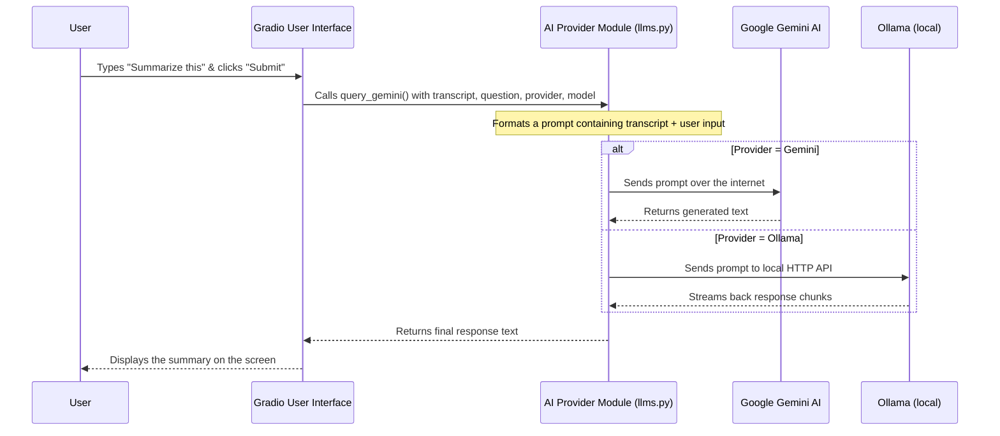

# Chapter 4: AI Provider Integration (Gemini + Ollama)

In the [previous chapter](03_media_pre_processing_pipeline_.md), we saw how our application cleverly prepares any audio or video file for transcription. The result of that process is a clean, accurate text transcript. This is already very useful, but what if we could do more?

Imagine you've just transcribed a one-hour meeting. You now have a long wall of text. Finding the key decisions or action items could mean reading the whole thing. What if you could just ask the application, "What were the main takeaways from this meeting?" and get a perfect summary?

This is exactly the problem that our AI Provider Integration solves. It's an optional but incredibly powerful feature that connects your transcript either to:

- **Google Gemini (cloud)** for high-quality analysis
- **Ollama (local)** for on-device/private analysis, as long as Ollama is installed and running

Think of it as hiring a brilliant assistant who can read your transcript in an instant and answer any question you have about it.

## The Smart Assistant for Your Transcript

Once you've generated a transcript, the AI integration adds a new set of controls to the user interface (inside the **AI Provider** box). It gives you a new superpower: the ability to have a conversation with your document.

Here’s what you can do:
-   **Summarize:** Ask "Summarize this transcript" to get a short, concise version.
-   **Extract Key Points:** Ask "What are the main topics discussed?" to get a bulleted list.
-   **Find Action Items:** Ask "List all the action items mentioned" to see who needs to do what.
-   **Ask Specific Questions:** Ask "What did Jane say about the budget?" to find specific information.

This feature transforms `whisper-utility` from a simple transcription tool into a powerful analytical assistant.

## The Journey of a Query: From Question to Answer

Let's follow a simple request from start to finish. You've transcribed a team meeting, and you want a summary.

1.  **The Transcript is Ready:** The transcription from the [Core Transcription Engine](02_core_transcription_engine_.md) is displayed in the output box.
2.  **You Ask a Question:** In a new text box labeled "Enter your query," you type: `Summarize this in three bullet points.`
3.  **You Click the Button:** You press the "Submit Query to Gemini" button.
4.  **The AI Responds:** A few seconds later, the "Gemini Response" area updates with something like this:
    *   *The team approved the Q3 marketing budget.*
    *   *John will follow up with the design team about the new logo.*
    *   *The project deadline was moved to November 15th.*

Behind the scenes, the application has sent your transcript and your question to the Gemini AI, which understood the context and provided the summary.

## Under the Hood: How it Works

How does our application talk to a powerful AI like Gemini? It happens through a process called an API call, which is like making a special, structured phone call to a web service.



Let's break down this process into its key steps.

### Step 1: Getting Access (Gemini API Key)

To use Google's Gemini service, our application needs permission. This permission is granted via a special secret code called an **API Key**. Think of it like a library card that proves you're allowed to use the AI's services.

Gemini is optional, so the application first checks if you've provided a key. It uses a helper function to look for it in a special configuration file.

```python
# File: config.py
def get_gemini_api_key():
    """Retrieve the Gemini API key from a configuration file."""
    try:
        # Tries to open a special file to find the key
        with open("config/gemini.yaml", "r") as ymlfile:
            # ... reads the key from the file ...
            return gemini["gemini_api_key"]
    except:
        # If the file or key doesn't exist, it returns nothing
        return None
```
    If this function finds a key, Gemini becomes available in the UI. If not, the UI defaults to Ollama.

    The file format is simple:

    ```yaml
    # File: config/gemini.yaml
    gemini_api_key: "YOUR_KEY_HERE"
    ```

### Step 2: Preparing the Question (Prompting)

We can't just send your question "Summarize this" to the AI by itself. The AI wouldn't know *what* to summarize! We need to provide context.

Our application cleverly combines the full transcript with your question into a single package called a **prompt**. This is handled inside our main Gemini function.

The same prompt format is used for both providers:

```python
# File: llms.py
prompt = f"Transcription: {transcription}\n\nUser Input: {user_input}"
```
This prompt gives the AI everything it needs: the document to analyze (`Transcription: ...`) and the instruction on what to do (`User Input: ...`).

### Step 3: Talking to the AI (Provider Dispatch)

With the prompt ready, our application makes the "call" to Google's servers. This is where the real magic happens. We send our carefully crafted prompt, and the Gemini model reads it, "thinks" about it, and generates a response.

The app uses a single dispatcher function that routes your request to Gemini or Ollama based on the selected provider:

```python
# File: llms.py
def query_gemini(user_input, transcription, gemini_model, provider="Gemini", ollama_model=None):
    if provider and str(provider).lower().startswith('olla'):
        return query_ollama(user_input, transcription, ollama_model)

    client = initialize_client()
    if not client:
            return "Error: Gemini API key not found."
    
    query = f"Transcription: {transcription}\n\nUser Input: {user_input}"
    config = get_gemini_config()
    
    return client.models.generate_content(
        model=gemini_model,
        contents=[query],
        config=config
    ).text
```

#### Ollama requirements

To use Ollama, it must be installed and running locally. The code talks to the Ollama daemon via HTTP (default: `http://127.0.0.1:11434`).
The line `client.models.generate_content(...)` is the most important part. It sends the request and waits for the text answer to come back.

### Step 4: Displaying the Answer

Finally, how does the AI's response get back to the screen? This is handled by the same event-listener pattern we saw in the [Gradio User Interface](01_gradio_user_interface_.md) chapter.

The "Submit Query" button is wired up to the same `query_gemini` dispatcher function.

```python
# File: ui.py

# When the button is clicked...
submit_query_button.click(
    fn=query_gemini,
    inputs=[user_query, output_text, gemini_model, provider, ollama_model],
    outputs=[gemini_response]
)
```
This tells Gradio: "When the submit button is clicked, run the `query_gemini` function. Give it the user's question and the full transcript. Take whatever it returns and display it in the `gemini_response` area."

## Conclusion

In this chapter, we've added a layer of advanced intelligence to our application. You've learned that the AI integration:

-   Acts as a **smart assistant** that can understand and analyze your transcripts.
-   Supports **Gemini (cloud)** and **Ollama (local)**.
-   Uses a single **prompt format** (transcript + user input).
-   Uses a simple **dispatcher** function to route to the chosen provider.

By connecting the output of our transcription engine to another powerful AI, we've turned `whisper-utility` from a simple dictation tool into a sophisticated research and analysis platform.

Now we have settings for transcription and optional settings for Gemini. How does the application manage all these choices? What if you find the perfect set of configurations and want to save them for later? That's the job of our next component.

Let's explore how we handle all these options in [Chapter 5: Configuration System](05_configuration_system_.md).

---

Generated by [AI Codebase Knowledge Builder](https://github.com/The-Pocket/Tutorial-Codebase-Knowledge)