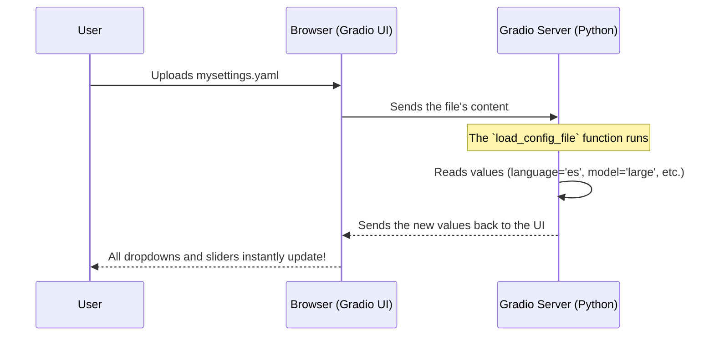

# Chapter 5: Configuration System

In the [previous chapter](04_gemini_ai_integration_.md), we added a powerful AI assistant to our application, which brought in its own set of choices, like which Gemini model to use. Now, our application has a lot of settings: the Whisper model size, the transcription language, performance tweaks, and the Gemini model.

What if you find the perfect combination of settings for your specific needs? Maybe you work with noisy audio and find that the `medium` model with a `beam_size` of 5 works best. Do you have to remember and set those every single time you open the application? Of course not!

This is where the Configuration System comes in. It's the application's "memory," allowing it to remember settings. Think of it as the preferences panel in any software you use. It gives you control over the application's behavior and lets you save your favorite setups for later.

## Starting with Sensible Defaults

When you first launch `whisper-utility`, how does it know what to show in the dropdown menus and sliders? It doesn't just guess. It loads a set of sensible default settings from a simple text file.

This file, `settings/default.yaml`, acts as the application's starting point. A `.yaml` file is just a human-readable way to store data.

Here's a small peek at what `settings/default.yaml` looks like:

```yaml
# File: settings/default.yaml

device: "cpu"
language: "en"
whisper_model: "base"
beam_size: 5
gemini_model: "gemini-pro"
```

This file tells the application: "When you start, set the device to CPU, the language to English, the Whisper model to 'base', and so on."

### Loading the Defaults

When the application starts, a small helper function in our `config.py` file reads this file and loads the values into memory.

```python
# File: config.py
import yaml

def load_default_config():
    """Loads the default configuration from settings/default.yaml."""
    with open("settings/default.yaml", "r") as ymlfile:
        return yaml.safe_load(ymlfile)
```

This function simply opens the file, reads its contents, and makes them available to the rest of the application. Now, our user interface knows exactly what values to display when it first appears.

```python
# File: ui.py

# Load the default settings when the UI is being built
default_config_values = load_default_config()

# ... inside the UI layout ...
whisper_model = gr.Dropdown(
    choices=['tiny', 'base', 'small', 'medium', 'large'],
    value=default_config_values["whisper_model"], # <-- Use the default value!
    label="Whisper Model"
)
```
As you can see, when the "Whisper Model" dropdown is created, its starting `value` is set directly from the settings we just loaded. Every other component does the same.

## Saving Your Own Perfect Setup

Let's say you've adjusted the settings for transcribing Spanish podcasts. You've chosen the Spanish language, a different model, and tweaked the performance sliders. You want to save this setup so you can use it again next week.

This is what the "Save configurations" button is for.

When you click this button, the application performs a simple but powerful action:
1.  It looks at the *current* value of every single setting in the UI.
2.  It gathers all these values together.
3.  It saves them into a new file called `settings/mysettings.yaml`.

The function that handles this is straightforward:

```python
# File: ui.py

def save_config(device, language, whisper_model, ...):
    """Gathers all current settings and saves them to a file."""
    config = {
        "device": device,
        "language": language,
        "whisper_model": whisper_model,
        # ... and all other settings
    }
    with open("settings/mysettings.yaml", "w") as file:
        yaml.dump(config, file)
```

After you click the button, you'll have a new `mysettings.yaml` file that is a snapshot of your current UI. It might look something like this:

```yaml
# File: settings/mysettings.yaml (Your saved settings)

device: "cpu"
language: "es"       # You changed this to Spanish
whisper_model: "large" # You chose the large model
beam_size: 10        # You adjusted this for better accuracy
# ... etc.
```

Now you have your custom configuration saved and ready to be used anytime.

## Loading Your Saved Settings

A week has passed, and it's time to transcribe another Spanish podcast. Instead of setting everything up again manually, you can now load your saved configuration with a single click.

This is handled by the "Load Configuration File" component. When you use it to upload your `mysettings.yaml` file, a magical chain of events happens.



Let's look at the code that makes this possible. First, the function that reads the uploaded file:

```python
# File: ui.py

def load_config_file(file_path):
    """Loads a YAML config file and returns the values."""
    try:
        config = yaml.safe_load(open(file_path.name, "r"))
        # Return all the values in the correct order
        return (
            config["device"],
            config["language"],
            config["whisper_model"],
            # ... and so on for every setting
        )
    except Exception as e:
        # Handle errors if the file is bad
        logging.error(f"Error loading configuration: {e}")
        # Return defaults if it fails
        return reset_fields() 
```

This function takes the uploaded file, reads the settings, and returns them. But how do these returned values update the UI? We connect the function to the UI component using an event listener called `.change()`.

```python
# File: ui.py

# The file upload component
load_configuration = gr.File(label="Load Configuration File")

# When the file changes (i.e., a file is uploaded)...
load_configuration.change(
    fn=load_config_file,       # ...run this function.
    inputs=[load_configuration], # ...give it the uploaded file.
    outputs=[
        device,
        language,
        whisper_model,
        # ...and every other UI component!
    ]
)
```
This `.change()` block tells Gradio: "Watch the `load_configuration` file box. As soon as a user uploads a file, run the `load_config_file` function. Take all the values it returns and use them to update the `device` dropdown, the `language` dropdown, the `whisper_model` dropdown, and all the others."

And just like that, your entire UI snaps to the saved settings from your file!

## Conclusion

In this chapter, you've learned about the brain behind the application's settings: the Configuration System. It's a simple yet powerful system that provides immense flexibility.

You now understand that:
-   The application starts with a set of **sensible defaults** loaded from `settings/default.yaml`.
-   You can **save your current settings** at any time to a `mysettings.yaml` file.
-   You can instantly **load a saved configuration** to restore a previous setup, saving you time and effort.

This system is what makes `whisper-utility` a tool that can be adapted to your specific workflow.

We have now explored all the core software components of our application, from the user interface to the AI engines to the settings manager. But right now, it's still a project that requires Python and some technical knowledge to run. How do we turn it into a simple, double-clickable application that anyone can use on their Windows or Mac computer?

Let's move on to the final step in our journey: [Chapter 6: Desktop Application Packaging](06_desktop_application_packaging_.md).

---

Generated by [AI Codebase Knowledge Builder](https://github.com/The-Pocket/Tutorial-Codebase-Knowledge)