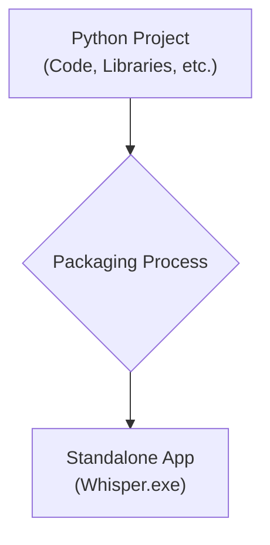
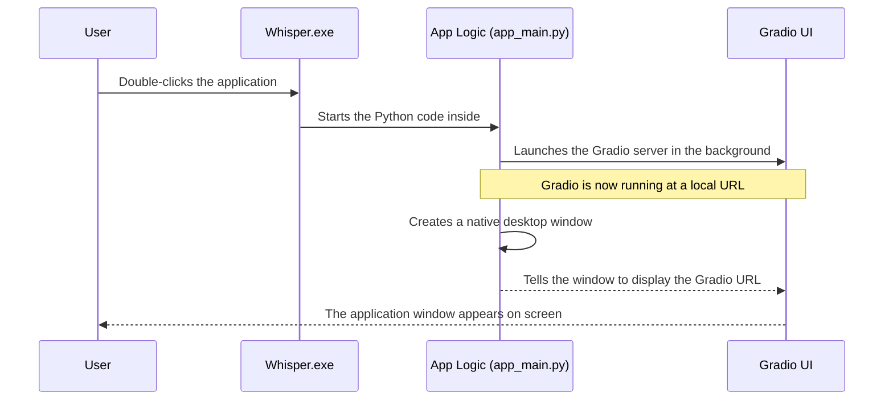

# Chapter 6: Desktop Application Packaging

In the [previous chapter](05_configuration_system_.md), we explored the Configuration System, which acts as the application's memory, allowing you to save and load your favorite settings. By now, we have a fully functional application with a user interface, a powerful transcription engine, AI integration, and a settings manager.

But there's one small catch: to run it, a user needs to have Python installed, know how to use a command line, and install all the required libraries. That's a lot to ask for someone who just wants to transcribe a file! What if we could bundle our entire project into a single, double-clickable program, just like Microsoft Word or Google Chrome?

This is the final, magical step in our journey: Desktop Application Packaging. This process takes our web-based application and transforms it into a standalone desktop program (an `.exe` file on Windows). It’s like taking a complex website and putting it inside a self-contained box that runs on your computer without needing a separate web browser or any technical setup.

## The Problem: From a Developer's Tool to a User's Program

Right now, `whisper-utility` is a Python project. It's a folder full of `.py` files, configuration files, and a list of dependencies. To use it, you have to be a bit of a developer.

Our goal is to bridge this gap. We want to give a friend a single file they can double-click to launch the application, with no installation or setup required.



This packaging process is the final assembly line that turns our collection of parts into a finished, polished product.

## The Two Key Ingredients for Packaging

To achieve this, we use two clever tools working together:

1.  **PyInstaller:** Think of PyInstaller as the master packer. Its job is to find every single piece of code our application needs—our own Python scripts, all the libraries we use (like Gradio and faster-whisper), and any other assets—and bundle them all together into a single folder or executable file. It "freezes" our application so it no longer depends on the user's Python installation.

2.  **`pywebview`:** Our application is built with Gradio, which runs as a local website. How do we make a website look and feel like a desktop app? That's the job of `pywebview`. It creates a simple, native window on your desktop and displays our Gradio interface inside it. It's the picture frame that goes around our web-based canvas, removing the browser's address bar and menus to create a seamless experience.

## The Launch Sequence: What Happens When You Double-Click?

When you double-click the final `Whisper.exe` file, a new sequence of events unfolds, different from running it as a Python script.



The user sees a single, clean application window pop up, just like any other program. They have no idea that a mini web server is running silently in the background!

## Under the Hood: The Special Entry Point

To make all of this work, we can't just run our old `main.py` script. We need a special entry point that is aware of both Gradio and `pywebview`. This is the job of `app_main.py`.

```python
# File: app_main.py
import webview
from main import demo as main 

# 1. Launch Gradio, but don't block the script
main.launch(prevent_thread_lock=True)

# 2. Create a desktop window
webview.create_window("🎙️ App Title", main.local_url)

# 3. Start the window
webview.start()
```

Let's break down this tiny but crucial script:
1.  `main.launch(prevent_thread_lock=True)`: This starts our Gradio UI, just like before. The special argument `prevent_thread_lock=True` tells it to run in the background so our script can continue to the next step.
2.  `webview.create_window(...)`: This is where `pywebview` works its magic. It creates a new window with a title. Critically, we tell it to display the content from `main.local_url`, which is the address of our running Gradio app.
3.  `webview.start()`: This command shows the window on the screen and starts the application loop.

This script is the glue that holds the packaged application together, connecting the web-based UI to a native desktop window.

### Special Instructions: The Hooks

When PyInstaller packs our application, it sometimes needs extra help. Our project uses complex libraries, and PyInstaller might not automatically know how to handle all their hidden files and quirks. To solve this, we provide "hooks"—small configuration files that give PyInstaller specific instructions.

A great example is the `runtime_hook.py` file.

```python
# File: runtime_hook.py
import PyInstaller.hooks.rthooks.pyi_rth_multiprocessing

if __name__ == "__main__":
    # This is necessary to prevent an infinite app launch loop.
    import multiprocessing
    multiprocessing.freeze_support()
```

You don't need to understand the details of this code. Just think of it as a mandatory safety check. When an application is "frozen," some processes can get confused and start an infinite loop of re-launching themselves. This hook prevents that from happening, ensuring our app starts smoothly just once.

Similarly, files like `hooks/hook-gradio.py` give PyInstaller hints on how to correctly package the Gradio library, ensuring all its necessary components are included in the final `.exe`.

## Compiling the Application

### Option 1: Compiling on Windows 🪟

On Windows, you have two easy ways to compile the application depending on your preferred terminal.

**Method A: Using Command Prompt (cmd) or PowerShell**
Simply double-click (or run) the `installer.bat` file.
```cmd
installer.bat
```
This script will:
1.  Activate the virtual environment.
2.  Run PyInstaller.
3.  Copy all necessary folders (`config`, `settings`, etc.) to the output directory.

**Method B: Using Git Bash**
If you prefer using a bash terminal (like Git Bash), you can use the provided script:
```bash
./build_windows.sh
```

### Option 2: Compiling on Linux 🐧

If you want to run this application on Linux, you **must** compile it on a Linux machine (cross-compilation is not supported).

**Steps:**
1.  Transfer the source code to your Linux machine.
2.  Open a terminal in the project directory.
3.  Make the script executable and run it:
    ```bash
    chmod +x build_linux.sh
    ./build_linux.sh
    ```

This script handles everything for you:
*   Creates a Linux-specific virtual environment (`.venv_linux`).
*   Installs dependencies (filtering out Windows-only packages).
*   Runs PyInstaller with the cross-platform `whisper.spec`.
*   Copies configuration files to the `dist` directory.

The final executable will be located in `dist/Whisper/Whisper`.

## Conclusion

Congratulations! You have reached the end of our journey through the `whisper-utility` project. In this chapter, you learned how we transform a developer-centric Python project into a user-friendly, standalone desktop application.

You now understand that:
-   **PyInstaller** acts as the "packer," bundling all our code and libraries into a single distributable package.
-   **`pywebview`** acts as the "window," seamlessly displaying our web-based Gradio UI in a native desktop frame.
-   A special entry point, `app_main.py`, orchestrates the launch, starting the Gradio server and then wrapping it in a `pywebview` window.
-   **Hooks** provide essential instructions to help PyInstaller handle the complexities of our project.

Over the past six chapters, we have dissected the entire application. We started with the friendly [Gradio User Interface](01_gradio_user_interface_.md), dove into the powerful [Core Transcription Engine](02_core_transcription_engine_.md), uncovered the clever [Media Pre-processing Pipeline](03_media_pre_processing_pipeline_.md), enhanced it with the [Gemini AI Integration](04_gemini_ai_integration_.md), managed its flexibility with the [Configuration System](05_configuration_system_.md), and finally, wrapped it all up into a polished product with Desktop Application Packaging.

You now have a complete picture of how a modern AI application is built, from the front-end controls to the back-end logic, and all the way to final delivery. We hope this tour has been insightful and empowers you to explore, modify, and build upon this project with confidence. Happy coding

---

Generated by [AI Codebase Knowledge Builder](https://github.com/The-Pocket/Tutorial-Codebase-Knowledge)